# PROTOCOL - flow-management supervisor

> Generated - do not edit by hand. Regenerate with
> `python3 networked_sensors/protocol_map.py --write` or check with
> `python3 networked_sensors/protocol_map.py --check`.

This is the runnable protocol map for the flow-management test bench. It tracks
how code is run, configured, selected, guarded, produced, and consumed. Run
outcomes and narrative findings belong in the procedure docs unless they change
this topology.

## 0. Regeneration rule

Build and use `protocol_map.py` once the repo has enough protocol topology that
a user or agent can get lost:

- more than one runnable verb;
- more than one config family;
- variants encoded as config axes;
- artifacts passed between scripts;
- or the first serious source/method integration task.

This directory is at that threshold: ESP32, DXMR90, and the Yún stepper are
separate source arms, and the supervisor makes them selectable producers of one
merged sample stream.
If a task changes how something is run, configured, selected, guarded, produced,
or consumed, `PROTOCOL.md` must be checked and probably regenerated.

## 1. Protocol graph

```mermaid
flowchart TD
    subgraph GOV["Development discipline"]
        DOCS["DEVELOPMENT-* / INTEGRATION-* / DOCUMENTATION-*"]
        PMAP["protocol_map.py<br/>--check / --write"]
        PROTO["PROTOCOL.md<br/>generated visual map"]
        DOCS -. "cadence lock" .-> PMAP
        PMAP --> PROTO
    end

    subgraph ESPHW["ESP32 hardware-facing surfaces"]
        INO["Flow_management_unit_sch1.ino<br/>headless v2 sensor/relay API"]
        SSE["/events<br/>v2 reading: time + p/f + volts + 4 sol"]
        SOLAPI["/solenoid/toggle?n=0..3<br/>POST returns ON/OFF"]
        LEGACYINO["legacy/Flow_management_unit_sch1/<br/>archived self-hosted dashboard"]
        LEGACYUI["archived HTML + /test/*<br/>not a laptop-adapter contract"]
        DXMCLI["read_dxmr90_modbus.py<br/>Modbus CLI + reusable reader"]
        INO --> SSE
        INO --> SOLAPI
        LEGACYINO --> LEGACYUI
    end

    subgraph YUNLOCAL["Standalone Yún stepper bring-up"]
        YUNSRC["limit_switch_palas.ino<br/>D2-D6 + D8"]
        AVRCLI["arduino-cli<br/>arduino:avr:yun"]
        YUNFW["Yún ATmega32U4<br/>Local Velocity + relative Web Position"]
        LIMITS["D6 positive / D8 negative<br/>magnetic limits"]
        DRIVER["DM542T<br/>STEP / DIR"]
        LIMITSER["9600-baud compact JSON status<br/>+ V1 S/D/M/H/G/X/E1/E0 commands"]
        USBADAPTER["UsbStepperSource<br/>mode + D8 seek + move/Stop + software E-STOP"]
        UART["Serial1 / /dev/ttyATH0<br/>non-blocking V1 relay"]
        YUNLINUX["yun_stepper_bridge.py<br/>AR9331 HTTP :8080"]
        NETADAPTER["NetworkStepperSource<br/>background 10 Hz + guarded commands"]
        GLNET["GL-MT3000-b3a<br/>2.4 GHz bench WLAN"]
        YUNSRC --> AVRCLI
        AVRCLI --> YUNFW
        LIMITS --> YUNFW
        YUNFW --> DRIVER
        YUNFW --> LIMITSER
        LIMITSER <--> USBADAPTER
        USBADAPTER --> MERGE
        YUNFW <--> UART
        UART <--> YUNLINUX
        YUNLINUX --> GLNET
        GLNET <--> NETADAPTER
        NETADAPTER --> MERGE
    end

    subgraph STEP12["Supervisor simulation"]
        CORE["supervisor_core.py<br/>schema + sources + merge"]
        SUPCLI["supervisor.py<br/>sim scenario CLI"]
        SCEN["--scenario<br/>healthy / stale / missing"]
        THRESH["--drop-after-s<br/>--stale-after-s"]
        SES["SimulatedEsp32Source<br/>10 Hz"]
        SDX["SimulatedDxmr90Source<br/>1 Hz"]
        SST["SimulatedStepperSource<br/>10 Hz motion + limits"]
        MERGE["SourceMerger<br/>latest value + age"]
        JSONL[("merged JSONL samples<br/>stdout artifact")]
        SCEN --> SUPCLI
        THRESH --> SUPCLI
        SES --> MERGE
        SDX --> MERGE
        SST --> MERGE
        CORE --> SES
        CORE --> SDX
        CORE --> SST
        CORE --> MERGE
        SUPCLI --> CORE
        SUPCLI --> JSONL
    end

    subgraph STEP3["Step 3 local dashboard/API"]
        DASHCLI["dashboard.py<br/>localhost server"]
        DASHHTML["/<br/>dashboard HTML"]
        DASHAPI["/api/state latest history"]
        DASHSSE["/api/events<br/>SSE samples"]
        DASHCTRL["/api/run metadata solenoid stepper<br/>recordings export"]
        SRCSEL["--esp32-source / --esp32-url / --esp32-timeout<br/>--dxmr90-source<br/>--stepper-source sim|usb|network|off<br/>--stepper-port / --stepper-baud<br/>--stepper-url / --stepper-timeout"]
        BROWSER["browser dashboard<br/>flow plots + stepper controls"]
        SRCSEL --> DASHCLI
        DASHCLI --> DASHHTML
        DASHCLI --> DASHAPI
        DASHCLI --> DASHSSE
        DASHCLI --> DASHCTRL
        DASHHTML --> BROWSER
        DASHAPI --> BROWSER
        DASHSSE --> BROWSER
        DASHCTRL --> BROWSER
    end

    subgraph STEP4["Step 4 recorder/exporter"]
        REC["recorder.py<br/>disk-backed run writer"]
        RUNDIR["--record-dir<br/>recordings root"]
        MERGED[("merged_samples.csv")]
        RAW[("esp32_raw.csv<br/>dxmr90_raw.csv<br/>stepper_raw.csv")]
        META[("metadata.json<br/>summary.json<br/>export.csv")]
        RUNDIR --> REC
        REC --> MERGED
        REC --> RAW
        REC --> META
    end

    subgraph STEP5["Step 5 SICK/DXMR90 real source"]
        DXCFG["--dxmr90-host port<br/>unit timeout addressing word-order<br/>--dxmr90-data-path --dxmr90-rate-hz"]
        SICKPD["direct SICK process data<br/>1002-1017 / 2002-2017<br/>10 Hz default"]
        REPUB["ScriptBasic republished block<br/>13001+ / approx 1 Hz<br/>diagnostic fallback"]
        RDXM["RealDxmr90Source<br/>decode + unit conversion"]
        DXCFG --> RDXM
        SICKPD --> RDXM
        REPUB --> RDXM
    end

    subgraph STEP6["Step 6 real ESP32 source"]
        ESPCFG["--esp32-source real<br/>--esp32-url --esp32-timeout"]
        RESP["RealEsp32Source<br/>strict v2 SSE + four solenoid POSTs"]
        ESPCFG --> RESP
    end

    SSE --> RESP
    SOLAPI <--> RESP
    DXMCLI --> RDXM
    RESP --> MERGE
    RDXM --> MERGE
    MERGE --> DASHCLI
    SCEN --> DASHCLI
    THRESH --> DASHCLI
    DASHCLI --> REC
```



## 2. Verb catalog

| Verb | File | Status | Consumes | Produces | Invocation contract |
| --- | --- | --- | --- | --- | --- |
| `supervisor` | `networked_sensors/supervisor.py` | exists | simulated ESP32 + DXMR90 + stepper sources, scenario axis | merged JSONL on stdout | `python3 networked_sensors/supervisor.py [--scenario healthy|esp32_stale|dxmr90_stale|dxmr90_missing|stepper_stale|stepper_missing|all_stale] [--samples N] [--rate-hz HZ] [--drop-after-s S] [--stale-after-s S] [--realtime]` |
| `dashboard` | `networked_sensors/dashboard.py` | simulated and real ESP32/DXMR90 plus simulated/USB/network Yún control exists; Yún LAN hardware installation remains | independently selected source arms, scenario axis, metadata, run state, record directory, solenoid and stepper commands/status | localhost/LAN dashboard, JSON API, SSE sample stream, disk-backed run artifacts | `python3 networked_sensors/dashboard.py [--host 127.0.0.1] [--port 8000] [--esp32-source sim|real|off] [--esp32-url URL] [--esp32-timeout S] [--dxmr90-source sim|real|off] [--stepper-source sim|usb|network|off] [--stepper-port /dev/ttyACM0] [--stepper-baud 9600] [--stepper-url http://YUN_IP:8080] [--stepper-timeout S] [--dxmr90-host HOST] [--dxmr90-port 502] [--dxmr90-unit-id 1] [--dxmr90-timeout S] [--dxmr90-addressing one-based|zero-based] [--dxmr90-word-order high-low|low-high] [--dxmr90-data-path direct|republished] [--dxmr90-rate-hz HZ] [--record-dir PATH]` |
| `protocol_map` | `networked_sensors/protocol_map.py` | Step 1 exists | protocol topology constants | `PROTOCOL.md` | `--check` verifies drift; `--write` regenerates |
| `read_dxmr90_modbus` | `networked_sensors/read_dxmr90_modbus.py` | exists | DXMR90 Modbus TCP registers | table/json/csv rows | `--host` selects device; `--format json` supports programmatic use |
| `Flow_management_unit_sch1` | `networked_sensors/Flow_management_unit_sch1.ino` | four-output headless v2 firmware exists and target compile passes; physical flash/wiring pending | ADS1115 analog channels + four active-low relays on GPIO 5/6/9/10 | complete version-2 SSE readings, immediate four-state solenoid events, toggle indices 0–3, and JSON service descriptor; no UI/recording | flash to `esp32:esp32:adafruit_feather_esp32s3_nopsram`; run laptop `dashboard.py` as the webpage |
| archived ESP32 dashboard | `networked_sensors/legacy/Flow_management_unit_sch1/Flow_management_unit_sch1.ino` | preserved reference firmware | ADS1115 analog channels + browser commands | former ESP32 HTML, partial unversioned SSE, and RAM CSV | not compatible with strict `RealEsp32Source`; flash only for deliberate legacy investigation |
| `limit_switch_palas` | `networked_sensors/limit_switch_palas.ino` | T6 raw-UART firmware compiles at 72% flash/54% RAM, is uploaded, and emits stopped USB status with owner none; Linux service/LAN smoke pending | D4, D5, D6/D8, USB or Linux-relayed `V1 S`/`V1 D`/`V1 M`, armed `V1 H`/relative `V1 G`, Web Position `V1 X`, and mode-independent latched `V1 E1` with D4-off `V1 E0` | Local Velocity plus relative Web Position, D8 seek, fixed acceleration, directional limits, immediate abort, software E-STOP, non-blocking Serial1 status/acks, and exclusive USB/network mutation ownership; no absolute-position safety gate and no safety-rated energy isolation | compile/upload as `arduino:avr:yun`; because the repository file is not in an Arduino-named sketch directory, stage it in a matching temporary sketch directory first |
| `yun_stepper_bridge` | `networked_sensors/yun_stepper_bridge.py` | Python 2/3 service and UART/HTTP loopback tests pass; Yún installation pending | compact ATmega status plus exact validated `V1` command lines on `/dev/ttyATH0` | trusted-LAN `GET /v1/status`, `GET /v1/health`, and `POST /v1/command` on port 8080 | install on Yún Linux after uploading the matching firmware; stop the archived official Bridge daemon because both use `/dev/ttyATH0` |
| `YunSerialTerminal` | retired official Bridge library example | temporary maintenance path, verified | Yún USB CDC plus AR9331 UART console; DM542T power must be off | interactive OpenWrt console for non-secret network inspection/configuration | compile/upload as `arduino:avr:yun`, monitor at 115200 baud, send `~~`; restore `limit_switch_palas` immediately after maintenance |

## 3. Source contracts

| Source | Adapter/class | Status | Rate target | Required values | Health fields |
| --- | --- | --- | --- | --- | --- |
| ESP32 simulated | `SimulatedEsp32Source` | exists | 10 Hz | pressure, flow, sensor volts, solenoid states, combined pressure/flow; dashboard can toggle simulated solenoids | `esp32_mode`, `esp32_connected`, `esp32_age_ms`, `esp32_transport_error` |
| DXMR90 simulated | `SimulatedDxmr90Source` | exists | 1 Hz | core DXMR90 metric names from `read_dxmr90_modbus.py` with `dxmr90_` prefix | `dxmr90_mode`, `dxmr90_connected`, `dxmr90_age_ms` |
| Yún stepper simulated | `SimulatedStepperSource` | exists | 10 Hz | local enable, state, relative pulse-count model, command ID, D6/D8 limits, and latched software E-STOP/reset | `stepper_mode`, `stepper_connected`, `stepper_age_ms` |
| Yún stepper USB | `UsbStepperSource` | T5A adapter/firmware uploaded and stopped latch/reset live smoke passed; moving E-STOP checks pending | state changes, 10 Hz moving status, 1 Hz idle heartbeat; mode/speed/mapping, D8 seek/move/Stop, and software E-STOP/reset | dual control modes, D4/D5 authority, D6/D8 directional stops, fixed acceleration, command/state/reason/capabilities, and explicit E-STOP latch; absolute position suppressed | same stepper health fields plus `stepper_transport_error`; software stop is not safety-rated |
| Yún stepper network | `NetworkStepperSource` + Yún Linux UART bridge | background 10 Hz HTTP/status and guarded command adapter implemented; loopback success/rejection/timeout/E-STOP pass; physical install pending | 10 Hz | same command/status semantics as USB, fresh command confirmation, and firmware-reported exclusive USB/network ownership | same stepper health fields plus HTTP/UART errors |
| ESP32 real | `RealEsp32Source` | strict v2 adapter implemented; four-output loopback HTTP/SSE contract and target firmware compile pass, physical smoke pending | 10 Hz firmware stream | required `v=2`, `sample_ms`, finite three-value `p[]`/`f[]`/`p_v[]`/`f_v[]`, four boolean `sol[]`, derived combined values, and toggle POST indices 0–3; older/incomplete readings are rejected | same ESP32 health fields plus reconnect/error detail |
| DXMR90 real | `RealDxmr90Source` | implemented and live-hardware verified | direct process data at 10 Hz default; configurable; republished fallback is about 1 Hz | values decoded from SICK windows `1002-1017` and `2002-2017`, including pressure in bar/psi, flow, and temperature | same DXMR90 health fields |

## 4. Simulation scenario axis

| Scenario | ESP32 behavior | DXMR90 behavior | Stepper behavior | Purpose |
| --- | --- | --- | --- | --- |
| `healthy` | emits at 10 Hz | emits at 1 Hz | emits at 10 Hz | baseline dashboard/recorder development |
| `esp32_stale` | stops after `--drop-after-s` | normal | normal | verify ESP32 stale status |
| `dxmr90_stale` | normal | stops after `--drop-after-s` | normal | verify DXMR90 stale status |
| `dxmr90_missing` | normal | never emits values | normal | verify missing Modbus source handling |
| `stepper_stale` | normal | normal | stops after `--drop-after-s` | verify stale motion-source status |
| `stepper_missing` | normal | normal | never emits values | verify missing motion-source handling |
| `all_stale` | stops after `--drop-after-s` | stops after `--drop-after-s` | stops after `--drop-after-s` | verify multi-source stale status |

`--stale-after-s` controls when the held latest value flips the matching
`*_connected` field to false. Missing sources keep the same expected value keys
with `null` values so downstream dashboard and recorder code can rely on a
stable shape.

## 5. Local dashboard/API and recording contract

`dashboard.py` runs selected source arms in a background thread and exposes them
to a local browser. Sources are independent: the page does not require ESP32
quorum to show SICK/DXMR90 values, and missing/offline sources preserve their
expected keys as `null` with `*_connected=false`. Step 4 adds a disk-backed
recorder: metadata, recent history, selected ESP32 solenoid state, and stepper
state remain live operator state, while run start/stop creates durable files
under `--record-dir`.

| Endpoint | Method | Produces/consumes | Notes |
| --- | --- | --- | --- |
| `/` | GET | HTML/CSS/JS dashboard | flow/pressure views plus source health, metadata, recording, solenoids, and positive stepper travel/speed controls with physical D5 direction |
| `/api/state` | GET | latest sample, run config/state, metadata, history size | page bootstrap |
| `/api/latest` | GET | latest sample and run state | polling fallback and smoke checks |
| `/api/history?limit=N` | GET | recent merged samples | bounded in-memory history |
| `/api/events` | GET | SSE `state` and `sample` events | primary live browser stream |
| `/api/run/start` / `/api/run/stop` | POST | recording flag, timestamps, run artifact metadata | start opens a run directory; stop finalizes metadata, summary, and export CSV |
| `/api/metadata` | POST | in-memory metadata object | accepts JSON object with known metadata keys |
| `/api/solenoid/toggle?n=0..3` | POST | selected ESP32 solenoid state and latest sample | simulation toggles locally; real mode forwards the ESP32 POST; index 3 maps to GPIO 10; immediate `sol` events and complete v2 readings update state |
| `/api/stepper/status` | GET | stable stepper health, mode, D4/D5, D6/D8, owner, configured/effective speed, and command state | USB position/target/remaining and software-envelope fields are null; legacy homed flag is not a Move guard |
| `/api/stepper/control-mode` | POST | strict boolean `web_position` | mode changes only while D4 is OFF and motion is stopped; boot/default is Local Velocity |
| `/api/stepper/home` | POST | no body fields | optional D8-limit seek; Web Position only, D4 armed, D5 Reverse, fixed 1.5 mm/s; not a Move prerequisite |
| `/api/stepper/move` | POST | positive relative travel `distance_mm` up to 137.18 mm, positive `speed_mm_s`, optional `command_id` | simulation, USB, and network; supervisor snapshots D5 and resolves a signed internal delta; adapter/firmware re-check D5; fixed 5 mm/s² acceleration, D4 arm, and directional D6/D8 stops; no absolute-position envelope |
| `/api/stepper/stop` | POST | immediate abort and current status | simulation plus USB/network Web Position modes; D4 OFF independently aborts physical motion |
| `/api/stepper/speed` | POST | `speed_mm_s` from 0.1 through 10.0 | USB/network Local Velocity; requires D4 OFF; changes the switch-controlled continuous speed without starting motion |
| `/api/stepper/direction-mapping` | POST | strict boolean `inverted` | USB/network only; requires supporting firmware and D4 OFF; changes electrical DIR polarity without moving or replacing D5 |
| `/api/recordings` | GET | known completed recordings and active recording status | scans `--record-dir` summaries |
| `/api/export/latest` | GET | latest completed `export.csv` | browser download path |
| `/api/export?run_id=...&file=...` | GET | selected artifact | allowed files include merged/export CSV, ESP32/DXMR90/stepper source CSVs, and metadata/summary JSON |

SICK-only live dashboard command shape:

```bash
python3 networked_sensors/dashboard.py --esp32-source off --dxmr90-source real --dxmr90-host HOST --dxmr90-data-path direct --dxmr90-rate-hz 10 --host 127.0.0.1 --port 8000
```

ESP32-only live dashboard command shape:

```bash
python3 networked_sensors/dashboard.py --esp32-source real --esp32-url http://ESP32_HOST --dxmr90-source off --stepper-source off --host 127.0.0.1 --port 8000
```

Yún-network live dashboard command shape after the matching firmware and Linux
service are installed:

```bash
python3 networked_sensors/dashboard.py --esp32-source off --dxmr90-source off --stepper-source network --stepper-url http://YUN_IP:8080 --stepper-timeout 0.75 --host 0.0.0.0 --port 8000
```

The real source defaults to direct SICK process data at 10 Hz. The
`republished` path reads the ScriptBasic `13001+` block and remains available
for diagnostics, but its observed update period is about 1.1-1.2 seconds.

## 6. Merge contract

`SourceMerger` emits one flat merged sample at the requested supervisor cadence.
Lower-rate source values are held at their latest known value and paired with
age fields.

Required Step-1 fields:

- `timestamp_iso`, `elapsed_s`
- `esp32_mode`, `esp32_connected`, `esp32_age_ms`, `esp32_transport_error`
- `dxmr90_mode`, `dxmr90_connected`, `dxmr90_age_ms`
- `stepper_mode`, `stepper_connected`, `stepper_age_ms`
- `esp32_p1_bar..esp32_p3_bar`
- `esp32_f1_gmin..esp32_f3_gmin`
- `esp32_payload_version`, `esp32_sample_ms`, and clamped pressure/flow sensor
  voltage fields
- `esp32_sol1..esp32_sol4`
- `esp32_p_combined_bar`, `esp32_f_combined_gmin`
- `dxmr90_heartbeat` and selected core DXMR90 metrics
- `dxmr90_port1_pressure_bar`, `dxmr90_port2_pressure_bar`, and the matching
  pressure delta for unit-consistent charting
- `stepper_state`, local enable, speed, command ID, D4/D5 raw/manual state,
  D6/D8 raw/active/latched state, blocked reason, control mode, post-boot
  D4-off arm state, D5-selected direction, move/D8-seek/mode/speed/direction
  capabilities, electrical direction mapping, owner, status sequence, and
  transport error. USB absolute position/target/remaining and travel-envelope
  fields are null; the legacy homed flag is not used for motion authorization.

## 7. Artifacts

| Artifact | Producer | Status | Contents | Notes |
| --- | --- | --- | --- | --- |
| merged JSONL stdout | `supervisor.py` | exists | one JSON object per merged sample | Step-1/2 smoke artifact |
| localhost/LAN dashboard/API | `dashboard.py` | exists | live HTML, JSON endpoints, SSE stream | shared simulation, USB, and Yún-network operator surface |
| in-memory dashboard state | `dashboard.py` | exists | recent history, current metadata, recording flag, simulated solenoids | live UI state |
| recording directory | `dashboard.py --record-dir` + `recorder.py` | exists | one subdirectory per run | defaults to `networked_sensors/recordings` |
| merged CSV | `recorder.py` | exists | `merged_samples.csv` with run elapsed, merged values, source mode/health/age fields | primary analysis table |
| source CSVs | `recorder.py` | exists | `esp32_raw.csv`, `dxmr90_raw.csv`, `stepper_raw.csv` with fresh source updates | stepper command/status shares the same run timeline as flow data |
| metadata + summary JSON | `recorder.py` | exists | `metadata.json`, `summary.json` | includes run config, metadata, row counts, legacy summary metrics |
| export CSV | `recorder.py` | exists | `export.csv` metadata header plus merged CSV | browser download path, preserves legacy metadata fields |
| generated protocol map | `protocol_map.py --write` | exists | this file | `--check` is the drift guard |
| archived ESP32 CSV | archived firmware `/test/csv` | preserved only | ESP32-only rows buffered in RAM | historical fallback artifact; not supervisor-owned or consumed by the laptop adapter |
| Yún raw limit diagnostics | `limit_switch_palas.ino` over USB Serial | exists | D6/D8 HIGH/open and LOW/closed transitions at 9600 baud | both installed switches were observed HIGH/open away and LOW/closed at the magnet |

## 8. Verification tiers

| Tier | Command | What it proves | Hardware required |
| --- | --- | --- | --- |
| imports | `python3 -m compileall -q networked_sensors` | modules parse/import dependencies are stdlib/local | No |
| source simulation smoke | `python3 networked_sensors/supervisor.py --samples 12` | healthy simulated ESP32 + DXMR90 merge, modes, connected flags, age fields | No |
| stale simulation smoke | `python3 networked_sensors/supervisor.py --scenario dxmr90_stale --samples 45 --drop-after-s 1 --stale-after-s 1` | held values age out and `dxmr90_connected` flips false | No |
| missing simulation smoke | `python3 networked_sensors/supervisor.py --scenario dxmr90_missing --samples 3` | expected DXMR90 keys are present with null values and disconnected status | No |
| stepper unit tests | `python3 -m unittest -v networked_sensors.test_stepper_control` | D5-selected travel, validation, stops, limits, dashboard runtime, latched software E-STOP/reset, USB/network transport behavior, and stable merged shape | No; 32 tests passed |
| USB status/control transport | the same unit-test command, including a pseudo-terminal | compact firmware JSON expands into the stable schema; exact speed/motion/E-STOP bytes and D4-off reset guard pass; missing USB is disconnected rather than fatal | No |
| Yún T4B compile/upload | temporary official Arduino CLI 1.5.1, AVR core 1.8.8, AccelStepper 1.64.0; compile and verified upload for `arduino:avr:yun` | compact status plus manual-speed command use 48% flash and 18% RAM; live D4-off 3.0 mm/s setpoint echo passes with zero effective motion | Yún over USB for upload/live echo; passed |
| Yún T4C compile/upload | same official temporary toolchain, compile and verified upload for `arduino:avr:yun` | direction mapping/status plus speed use 49% flash and 18% RAM; live Normal mapping/capability pass with D4 OFF and zero motion | Yún over USB for upload/live status; passed |
| Yún T5 compile | same official temporary toolchain, compile for `arduino:avr:yun` | limit-switch-only dual-mode firmware, boot disarm, optional D8 seek, relative move, Stop, and fixed acceleration fit at 63% flash and 27% global RAM | No; passed |
| Yún T5 upload/stopped live status | verified upload plus USB-backed localhost status probe | Local Velocity, D4 OFF, D5 Forward, D6/D8 clear, boot armed, absolute position fields null, and zero effective speed | Yún over USB; passed without issuing motion |
| Yún T5 transport tests | `python3 -m unittest -v networked_sensors.test_stepper_control` | mode/D8-seek/move/Stop wire bytes, unreferenced move acceptance, positive magnitude plus D5 Reverse resolving to a negative delta, status decoding, runtime acknowledgement, D5/limit guards, and simulation pass | No; 22 tests passed |
| Yún T5A compile/upload | same official temporary toolchain, `arduino:avr:yun`, `/dev/ttyACM0` | 65% flash/28% RAM; 18,652 bytes written/read back; D4-off state-9 latch/reset passed; priority dispatch with unreachable DXMR90 reduced stopped acknowledgement from 1.26 s to 0.041 s | Yún over USB; passed; moving stops/latency pending |
| Yún T5A desktop contract | `python3 -m unittest -v networked_sensors.test_stepper_control` | simulation and dashboard latch/reset, fresh USB acknowledgement, status state 9, exact `V1 E1`/`V1 E0`, D4-on reset rejection, and backward-compatible old-frame decoding | No; 26 tests passed |
| Yún network bridge contract | `python3 -m unittest -v networked_sensors.test_stepper_control.NetworkStepperSourceTests` | exact UART command relay, background network status, explicit owner decode, firmware rejection, acknowledgement timeout, source factory/CLI, and fresh dashboard E-STOP confirmation | localhost + pseudo-terminal only; 6 tests pass, physical Yún pending |
| stepper dashboard/API smoke | dashboard plus GET status and POST move/stop | one existing page controls simulation and recorder writes `stepper_raw.csv` alongside flow sources | No |
| protocol drift | `python3 networked_sensors/protocol_map.py --check` | generated protocol graph/tables match repo topology | No |
| dashboard/API smoke | `python3 networked_sensors/dashboard.py --host 127.0.0.1 --port 8000` plus localhost GET/POST/SSE probes | local UI and API render live samples, stale/missing source state, metadata, run state, and simulated solenoid controls | No |
| recording/export smoke | `python3 networked_sensors/dashboard.py --record-dir /tmp/flow-dashboard-recordings` plus localhost start/stop/export probes | start/stop writes merged/source CSV, metadata JSON, summary JSON, export CSV, and download endpoints serve them | No |
| no-quorum source smoke | source factory with `--esp32-source off --dxmr90-source real` against unreachable host | dashboard samples still emit with ESP32 and SICK/DXMR90 disconnected/null rather than failing | No |
| ESP32 adapter contract | `python3 -m unittest -v networked_sensors.test_real_esp32` | primary/legacy layout, GPIO 10/fourth button, strict v2 decode/rejection, complete background `/events` projection, fourth-channel toggle POST, and dashboard real-source selection pass | No; 6 loopback/layout tests passed |
| ESP32 headless compile | temporary Arduino CLI/core/libraries, `esp32:esp32:adafruit_feather_esp32s3_nopsram` | four-output primary firmware compiles at 1,095,265 bytes/52% flash and 80,940 bytes/24% global RAM without HTML or `/test/*` | No; passed |
| ESP32 physical smoke | dashboard with `--esp32-source real --esp32-url URL` | sustained stream, plausible readings, safe real solenoid toggle, and recorded rows | ESP32 network |
| SICK/DXMR90 adapter smoke | dashboard `--dxmr90-source real --dxmr90-data-path direct --dxmr90-rate-hz 10` plus API/history probe | both direct SICK process windows decode, fresh source rows sustain 10 Hz, and selected metrics reach the browser | SICK/DXMR90 network |
| Yún T6 compile/upload | `arduino-cli compile/upload --fqbn arduino:avr:yun ...` | dual USB/Serial1 transport, ownership, motion, limits, and E-STOP use 20,794 bytes/72% flash and 1,399 bytes/54% RAM; stopped USB heartbeat reports no owner/motion and clear limits | Yún USB; passed, Linux service/LAN pending |
| Yún USB upload | `arduino-cli upload --fqbn arduino:avr:yun --port /dev/ttyACM0 ...` | Caterina USB upload and verification succeed | Yún over USB; motor supply off |
| Yún limit-input smoke | `arduino-cli monitor --port /dev/ttyACM0 --config baudrate=9600` | D6/D8 transition repeatably when each piston magnet reaches its switch | Yún + both switches; motor supply off |
| Yún Wi-Fi smoke | temporary `YunSerialTerminal`, then `iwinfo`, `ip`, and gateway ping | OpenWrt associates to `GL-MT3000-b3a` with WPA2/CCMP, receives DHCP, and reaches the router | Yún over USB + bench WLAN; motor supply off |
| full bench run | planned Step 8 | merged hardware data, motion, limits, staleness, metadata, and CSV export behave together | ESP32 + DXMR90 + Yún stepper |

## 9. Open protocol decisions

- Whether logs should remain CSV/JSON only or also add SQLite. CSV/JSON is
  sufficient for the first supervisor; SQLite becomes attractive when runs get
  long or many.
- Whether source CSVs should later include the original 16-bit SICK words in
  addition to the decoded 10 Hz values. The current real adapter preserves the
  engineering values and transport cadence, not every raw word.
- Whether the normally-open magnetic switches should be replaced or interfaced
  through fail-safe hardware so a broken limit wire cannot look clear.
