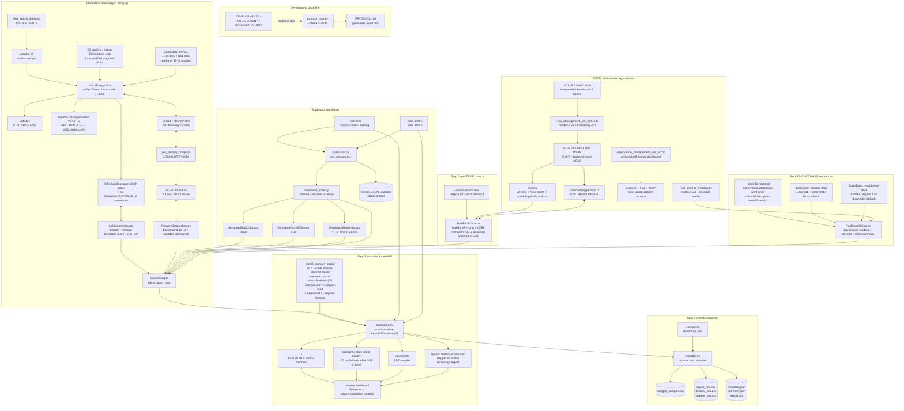

# PROTOCOL - flow-management supervisor

> Generated - do not edit by hand. Regenerate with
> `python3 networked_sensors/protocol_map.py --write` or check with
> `python3 networked_sensors/protocol_map.py --check`.

This is the runnable protocol map for the flow-management test bench. It tracks
how code is run, configured, selected, guarded, produced, and consumed. Run
outcomes and narrative findings belong in the procedure docs unless they change
this topology.

## 0. Regeneration rule

Build and use `protocol_map.py` once the repo has enough protocol topology that
a user or agent can get lost:

- more than one runnable verb;
- more than one config family;
- variants encoded as config axes;
- artifacts passed between scripts;
- or the first serious source/method integration task.

This directory is at that threshold: ESP32, DXMR90, and the Yún stepper are
separate source arms, and the supervisor makes them selectable producers of one
merged sample stream.
If a task changes how something is run, configured, selected, guarded, produced,
or consumed, `PROTOCOL.md` must be checked and probably regenerated.

## 1. Protocol graph


```mermaid
flowchart TD
    subgraph GOV["Development discipline"]
        DOCS["DEVELOPMENT-* / INTEGRATION-* / DOCUMENTATION-*"]
        PMAP["protocol_map.py<br/>--check / --write"]
        PROTO["PROTOCOL.md<br/>generated visual map"]
        DOCS -. "cadence lock" .-> PMAP
        PMAP --> PROTO
    end

    subgraph ESPHW["ESP32 hardware-facing surfaces"]
        INO["Flow_management_unit_sch1.ino<br/>headless v3 sensor/relay API"]
        ADCOPT["ADS1115 0x48 / 0x49<br/>independent health; null if absent"]
        ESPWLAN["GL-MT3000-b3a field WLAN<br/>DHCP + testbench.local mDNS"]
        SSE["/events<br/>v3: time + ADC health + nullable p/f/volts + 4 sol"]
        SOLAPI["/solenoid/toggle?n=0..3<br/>POST returns ON/OFF"]
        LEGACYINO["legacy/Flow_management_unit_sch1/<br/>archived self-hosted dashboard"]
        LEGACYUI["archived HTML + /test/*<br/>not a laptop-adapter contract"]
        DXMCLI["read_dxmr90_modbus.py<br/>Modbus CLI + reusable reader"]
        ADCOPT --> INO
        INO --> ESPWLAN
        ESPWLAN --> SSE
        ESPWLAN --> SOLAPI
        LEGACYINO --> LEGACYUI
    end

    subgraph YUNLOCAL["Standalone Yún stepper bring-up"]
        YUNSRC["limit_switch_palas.ino<br/>D2-D6 + D8-D12"]
        AVRCLI["arduino-cli<br/>arduino:avr:yun"]
        YUNFW["Yún ATmega32U4<br/>unified Timer1 Local / Web / Home"]
        LIMITS["D6 positive / bottom<br/>D8 negative / top<br/>5 ms qualified magnetic limits"]
        DRO["AbsoluteDRO Plus<br/>D10 clock + D11 data<br/>read-only 52-bit position"]
        DRIVER["DM542T<br/>STEP / DIR / ENA-"]
        ESC["BadAss Renegade 130A V2 OPTO<br/>D12 · 1000 us OFF / 1000..2000 us ON"]
        LIMITSER["9600-baud compact JSON status<br/>+ V1 S/M/H/G/X/E1/E0/B0/B1/P commands"]
        USBADAPTER["UsbStepperSource<br/>stepper + variable brushless pulse + E-STOP"]
        UART["Serial1 / /dev/ttyATH0<br/>non-blocking V1 relay"]
        YUNLINUX["yun_stepper_bridge.py<br/>AR9331 HTTP :8080"]
        NETADAPTER["NetworkStepperSource<br/>background 10 Hz + guarded commands"]
        GLNET["GL-MT3000-b3a<br/>2.4 GHz bench WLAN"]
        YUNSRC --> AVRCLI
        AVRCLI --> YUNFW
        LIMITS --> YUNFW
        DRO --> YUNFW
        YUNFW --> DRIVER
        YUNFW --> ESC
        YUNFW --> LIMITSER
        LIMITSER <--> USBADAPTER
        USBADAPTER --> MERGE
        YUNFW <--> UART
        UART <--> YUNLINUX
        YUNLINUX --> GLNET
        GLNET <--> NETADAPTER
        NETADAPTER --> MERGE
    end

    subgraph STEP12["Supervisor simulation"]
        CORE["supervisor_core.py<br/>schema + sources + merge"]
        SUPCLI["supervisor.py<br/>sim scenario CLI"]
        SCEN["--scenario<br/>healthy / stale / missing"]
        THRESH["--drop-after-s<br/>--stale-after-s"]
        SES["SimulatedEsp32Source<br/>10 Hz"]
        SDX["SimulatedDxmr90Source<br/>1 Hz"]
        SST["SimulatedStepperSource<br/>10 Hz motion + limits"]
        MERGE["SourceMerger<br/>latest value + age"]
        JSONL[("merged JSONL samples<br/>stdout artifact")]
        SCEN --> SUPCLI
        THRESH --> SUPCLI
        SES --> MERGE
        SDX --> MERGE
        SST --> MERGE
        CORE --> SES
        CORE --> SDX
        CORE --> SST
        CORE --> MERGE
        SUPCLI --> CORE
        SUPCLI --> JSONL
    end

    subgraph STEP3["Step 3 local dashboard/API"]
        DASHCLI["dashboard.py<br/>localhost server<br/>fresh-DRO velocity fit"]
        DASHHTML["/<br/>local HTML/CSS/ES modules"]
        DASHAPI["/api/config state latest history<br/>100 ms fallback while SSE is down"]
        DASHSSE["/api/events<br/>SSE samples"]
        DASHCTRL["/api/run metadata solenoid stepper brushless<br/>recordings export"]
        SRCSEL["--esp32-source / --esp32-url / --esp32-timeout<br/>--dxmr90-source<br/>--stepper-source sim|usb|network|off<br/>--stepper-port / --stepper-baud<br/>--stepper-url / --stepper-timeout"]
        BROWSER["browser dashboard<br/>flow plots + stepper/brushless controls"]
        SRCSEL --> DASHCLI
        DASHCLI --> DASHHTML
        DASHCLI --> DASHAPI
        DASHCLI --> DASHSSE
        DASHCLI --> DASHCTRL
        DASHHTML --> BROWSER
        DASHAPI --> BROWSER
        DASHSSE --> BROWSER
        DASHCTRL --> BROWSER
    end

    subgraph STEP4["Step 4 recorder/exporter"]
        REC["recorder.py<br/>disk-backed run writer"]
        RUNDIR["--record-dir<br/>recordings root"]
        MERGED[("merged_samples.csv")]
        RAW[("esp32_raw.csv<br/>dxmr90_raw.csv<br/>stepper_raw.csv")]
        META[("metadata.json<br/>summary.json<br/>export.csv")]
        RUNDIR --> REC
        REC --> MERGED
        REC --> RAW
        REC --> META
    end

    subgraph STEP5["Step 5 SICK/DXMR90 real source"]
        DXCFG["--dxmr90-host port<br/>unit timeout addressing word-order<br/>--dxmr90-data-path --dxmr90-rate-hz"]
        SICKPD["direct SICK process data<br/>1002-1017 / 2002-2017<br/>10 Hz default"]
        REPUB["ScriptBasic republished block<br/>13001+ / approx 1 Hz<br/>diagnostic fallback"]
        RDXM["RealDxmr90Source<br/>background Modbus + decode + unit conversion"]
        DXCFG --> RDXM
        SICKPD --> RDXM
        REPUB --> RDXM
    end

    subgraph STEP6["Step 6 real ESP32 source"]
        ESPCFG["--esp32-source real<br/>--esp32-url --esp32-timeout"]
        RESP["RealEsp32Source<br/>healthy v2 + strict v3 SSE<br/>cached mDNS + serialized solenoid POSTs"]
        ESPCFG --> RESP
    end

    SSE --> RESP
    SOLAPI <--> RESP
    DXMCLI --> RDXM
    RESP --> MERGE
    RDXM --> MERGE
    MERGE --> DASHCLI
    SCEN --> DASHCLI
    THRESH --> DASHCLI
    DASHCLI --> REC
```

## 2. Verb catalog

| Verb | File | Status | Consumes | Produces | Invocation contract |
| --- | --- | --- | --- | --- | --- |
| `supervisor` | `networked_sensors/supervisor.py` | exists | simulated ESP32 + DXMR90 + stepper sources, scenario axis | merged JSONL on stdout | `python3 networked_sensors/supervisor.py [--scenario healthy|esp32_stale|dxmr90_stale|dxmr90_missing|stepper_stale|stepper_missing|all_stale] [--samples N] [--rate-hz HZ] [--drop-after-s S] [--stale-after-s S] [--realtime]` |
| `dashboard` | `networked_sensors/dashboard.py` | simulated and real ESP32/DXMR90 plus simulated/USB/network Yún control exists; physical stopped Yún LAN path passes | independently selected source arms, scenario axis, metadata, run state, record directory, persistent system config, solenoid and stepper commands/status | localhost/LAN dashboard, JSON API, SSE sample stream, disk-backed run artifacts | `python3 networked_sensors/dashboard.py [--host 127.0.0.1] [--port 8000] [--esp32-source sim|real|off] [--esp32-url URL] [--esp32-timeout S] [--dxmr90-source sim|real|off] [--stepper-source sim|usb|network|off] [--stepper-port /dev/ttyACM0] [--stepper-baud 9600] [--stepper-url http://YUN_IP:8080] [--stepper-timeout S] [--dxmr90-host HOST] [--dxmr90-port 502] [--dxmr90-unit-id 1] [--dxmr90-timeout S] [--dxmr90-addressing one-based|zero-based] [--dxmr90-word-order high-low|low-high] [--dxmr90-data-path direct|republished] [--dxmr90-rate-hz HZ] [--record-dir PATH] [--system-config PATH]` |
| `run_lan_dashboard` | `networked_sensors/run_lan_dashboard.sh` | exists | environment-selected Yún URL, DXMR90 host, ESP32 source/URL, bind host/port, plus optional dashboard CLI arguments | one-command production-LAN dashboard process | defaults to network Yún at `http://arduino.local:8080`, real DXMR90 at `192.168.0.1`, real ESP32 at `http://testbench.local`, and `0.0.0.0:8000`; sources remain independent |
| `provision_yun` | `networked_sensors/provision_yun.sh` | physical key install, bridge deploy, boot enable, reboot/status check, and target Wi-Fi storage pass | current reachable Yún host, optional target SSID, one-time interactive credentials, local bridge/init files | dedicated maintenance key, deployed boot service, optional committed next-boot station config | `networked_sensors/provision_yun.sh CURRENT_YUN_HOST [TARGET_WIFI_SSID]`; not an ordinary startup step |
| `protocol_map` | `networked_sensors/protocol_map.py` | exists; validates generated-file drift plus source-backed and semantic invariants | protocol topology constants and selected source contracts | `PROTOCOL.md` | `--check` rejects drift, undocumented dashboard endpoints, V1 grammar/pin-map mismatches, ambiguous historical rows, and volatile current test counts; `--write` regenerates only after those checks pass |
| `read_dxmr90_modbus` | `networked_sensors/read_dxmr90_modbus.py` | exists | DXMR90 Modbus TCP registers | table/json/csv rows | `--host` selects device; `--format json` supports programmatic use |
| `Flow_management_unit_sch1` | `networked_sensors/Flow_management_unit_sch1.ino` | four-output headless v3 field-WLAN firmware is compiled and hash-verified on the physical board; field-LAN stream smoke pending | independently optional ADS1115 analog channels + four active-low relays on GPIO 5/6/9/10 | DHCP client at `testbench.local`, 10 Hz v3 SSE with per-ADC health and null unavailable families, immediate four-state solenoid events, toggle indices 0–3, and JSON service descriptor; no UI/recording | flash to `esp32:esp32:adafruit_feather_esp32s3_nopsram`; run laptop `dashboard.py` as the webpage; no ADC is a Wi-Fi/control startup gate |
| archived ESP32 dashboard | `networked_sensors/legacy/Flow_management_unit_sch1/Flow_management_unit_sch1.ino` | preserved reference firmware | ADS1115 analog channels + browser commands | former ESP32 HTML, partial unversioned SSE, and RAM CSV | not compatible with strict `RealEsp32Source`; flash only for deliberate legacy investigation |
| `limit_switch_palas` | `networked_sensors/limit_switch_palas.ino` | current variable-pulse D12 revision compiles at 22,532 bytes/78% flash and 1,692 bytes/66% RAM; upload and physical verification remain, while the immediately preceding fixed-1200 us revision is installed and reports live 1000 us OFF | D4, D5, physical D6/D8, D9-to-DM542T-ENA-, level-shifted AbsoluteDRO Plus D10 clock/D11 data, D12 OPTO ESC signal at 1000 us OFF and configurable 1000..2000 us ON, and USB/Linux-relayed `V1 S/M/H/G/X/E1/E0/B0/B1/P` | Timer1 exclusively drives Local Velocity, Web Position, and Home STEP timing; independent Timer3 generates the 50 Hz D12 ESC pulse; `V1 P` configures the ON width and `V1 B0|1` selects OFF/ON; software E-STOP forces brushless OFF as well as stopping the stepper; existing fixed direction, qualified limits, driver wake-up, DRO telemetry, non-blocking transports, and measured STEP output remain | compile/upload as `arduino:avr:yun`; no external Arduino library is required; because the repository file is not in an Arduino-named sketch directory, stage it in a matching temporary sketch directory first |
| `yun_stepper_bridge` | `networked_sensors/yun_stepper_bridge.py` | Python 2/3 loopback plus earlier physical health, stopped status, rejection, and boot-start pass; current no-`V1 D` repository copy must be redeployed before LAN motion testing | compact ATmega status plus exact validated `V1` command lines on `/dev/ttyATH0` | trusted-LAN `GET /v1/status`, `GET /v1/health`, and `POST /v1/command` on port 8080 | init wrapper temporarily disables LEDEYun `askconsole` while running and restores it on stop; provisioner installs and enables it |
| `YunSerialTerminal` | retired official Bridge library example | temporary maintenance path, verified | Yún USB CDC plus AR9331 UART console; DM542T power must be off | interactive OpenWrt console for non-secret network inspection/configuration | compile/upload as `arduino:avr:yun`, monitor at 115200 baud, send `~~`; restore `limit_switch_palas` immediately after maintenance |

## 3. Source contracts

| Source | Adapter/class | Status | Rate target | Required values | Health fields |
| --- | --- | --- | --- | --- | --- |
| ESP32 simulated | `SimulatedEsp32Source` | exists | 10 Hz | pressure, flow, sensor volts, solenoid states, combined pressure/flow; dashboard can toggle simulated solenoids | `esp32_mode`, `esp32_connected`, `esp32_age_ms`, `esp32_transport_error` |
| DXMR90 simulated | `SimulatedDxmr90Source` | exists | 1 Hz | core DXMR90 metric names from `read_dxmr90_modbus.py` with `dxmr90_` prefix | `dxmr90_mode`, `dxmr90_connected`, `dxmr90_age_ms` |
| Yún stepper simulated | `SimulatedStepperSource` | exists | 10 Hz | stepper model, D6/D8 limits, variable brushless OFF/ON pulse, and latched software E-STOP/reset | `stepper_mode`, `stepper_connected`, `stepper_age_ms` |
| Yún stepper USB | `UsbStepperSource` | variable-pulse adapter implemented; target upload pending; backward-compatible with installed fixed-1200 us revision | existing stepper/DRO status plus brushless OFF/ON, configured pulse, and software E-STOP/reset | `bo` reports OFF/ON; `bp` presence identifies variable-pulse support and carries the 1000..2000 us ON setpoint; active output is 1000 us while OFF; E-STOP requires `bo:0`; existing Timer1, limit, direction, driver, DRO, and transport contracts remain |
| Yún stepper network | `NetworkStepperSource` + Yún Linux UART bridge | background 10 Hz HTTP/status and guarded command adapter implemented; loopback contract plus physical stopped health/status/rejection and boot restart pass | 10 Hz | same calibrated command/status semantics as USB, fresh command confirmation, and firmware-reported exclusive USB/network ownership | same stepper health fields plus HTTP/UART errors |
| ESP32 real | `RealEsp32Source` | healthy-v2 compatibility plus strict v3 adapter implemented; missing-ADC/four-output and delayed-command loopback tests, target compile, and verified flash pass; field latency retest pending | 10 Hz firmware stream even with either ADC absent; 10 Hz browser SSE or fallback | v3 requires `sample_ms`, boolean `p_adc_ok`/`f_adc_ok`, finite triplets when ready or null triplets when unavailable, four boolean `sol[]`, and serialized toggle POST indices 0–3 outside the merge lock; healthy complete v2 remains accepted | source health fields plus ADC readiness and reconnect/error detail; HTTP `.local` resolution is cached until a transport failure |
| DXMR90 real | `RealDxmr90Source` | background adapter implemented, live-hardware verified, and blocked-read isolation/recovery tested | direct process data at 10 Hz default; configurable; republished fallback is about 1 Hz | values decoded from SICK windows `1002-1017` and `2002-2017`, including pressure in bar/psi, flow, and temperature | source-owned worker keeps Modbus timeout/error/staleness from blocking other sources; same DXMR90 health fields |

## 4. Simulation scenario axis

| Scenario | ESP32 behavior | DXMR90 behavior | Stepper behavior | Purpose |
| --- | --- | --- | --- | --- |
| `healthy` | emits at 10 Hz | emits at 1 Hz | emits at 10 Hz | baseline dashboard/recorder development |
| `esp32_stale` | stops after `--drop-after-s` | normal | normal | verify ESP32 stale status |
| `dxmr90_stale` | normal | stops after `--drop-after-s` | normal | verify DXMR90 stale status |
| `dxmr90_missing` | normal | never emits values | normal | verify missing Modbus source handling |
| `stepper_stale` | normal | normal | stops after `--drop-after-s` | verify stale motion-source status |
| `stepper_missing` | normal | normal | never emits values | verify missing motion-source handling |
| `all_stale` | stops after `--drop-after-s` | stops after `--drop-after-s` | stops after `--drop-after-s` | verify multi-source stale status |

`--stale-after-s` controls when the held latest value flips the matching
`*_connected` field to false. Missing sources keep the same expected value keys
with `null` values so downstream dashboard and recorder code can rely on a
stable shape.

## 5. Local dashboard/API and recording contract

`dashboard.py` runs selected source arms in a background thread and exposes them
to a local browser. Real ESP32, DXMR90, and network Yún I/O also use source-owned
workers, so one network timeout cannot stall the 10 Hz merge/recording cadence.
Sources are independent: the page does not require ESP32 quorum to show
SICK/DXMR90 values, and missing/offline sources preserve their
expected keys as `null` with `*_connected=false`. Step 4 adds a disk-backed
recorder: metadata, recent history, selected ESP32 solenoid state, and stepper
state remain live operator state, while run start/stop creates durable files
under `--record-dir`.

The page is served as local, cache-disabled static assets under
`dashboard_app/static`; it has no CDN, package download, or build step.
`/api/config` supplies read-only controller limits to browser inputs so visible
bounds and JavaScript validation cannot drift from Python command guards.

Browser samples use SSE at 10 Hz. If SSE is unavailable, a guarded 100 ms
`/api/latest` fallback starts and stops again when SSE reconnects. Solenoid
commands are serialized outside the shared merge condition, provide immediate
pending feedback, and reuse a resolved `.local` address so command response
latency cannot freeze sample publication or repeatedly pay mDNS lookup cost.
In Web Position mode, guarded Space-key input shares the page's Move action
while idle and Stop action while moving. Editable or focused interactive
controls, repeat/modifier events, unavailable actions, and duplicate in-flight
commands suppress that global shortcut.
Guarded `M` input shares the compact brushless-motor toggle and uses the same
editable/control/repeat/modifier suppression.

| Endpoint | Method | Produces/consumes | Notes |
| --- | --- | --- | --- |
| `/` | GET | HTML/CSS/JS dashboard | stepper mode, speed, and apply controls stay together first; the final brushless block accepts an integer 1000..2000 us ON pulse, shows the active D12 timer, and retains guarded M for OFF/ON |
| `/api/config` | GET | history capacity, solenoid count, and read-only stepper distance/speed/home limits | page bootstrap; values originate in Python and populate browser attributes/validation |
| `/api/state` | GET | latest sample, run config/state, metadata, history size | page bootstrap |
| `/api/latest` | GET | latest sample and run state | non-overlapping 100 ms browser fallback while SSE is unavailable, plus smoke checks |
| `/api/history?limit=N` | GET | recent merged samples | bounded in-memory history |
| `/api/events` | GET | SSE `state` and `sample` events | primary live browser stream |
| `/api/run/start` / `/api/run/stop` | POST | recording flag, timestamps, run artifact metadata | start opens a run directory; stop finalizes metadata, summary, and export CSV |
| `/api/metadata` | POST | in-memory metadata object | accepts JSON object with known metadata keys |
| `/api/solenoid/toggle?n=0..3` | POST | selected ESP32 solenoid state and latest sample | simulation toggles locally; real mode serializes one ESP32 POST outside the merge lock only while its stream is live; buttons and guarded keyboard keys 1-4 share this action; editable fields, repeats, modifiers, disabled controls, and pending channels suppress shortcuts; index 3 maps to GPIO 10; immediate `sol` events and v3 readings update state |
| `/api/stepper/status` | GET | stable stepper/DRO health plus brushless motor capability, OFF/ON state, active pulse, and configured ON pulse | compact `bo` reports state; optional `bp` identifies variable-pulse support and reports the configured 1000..2000 us ON width; absence of `bp` decodes as the backward-compatible fixed 1200 us revision |
| `/api/stepper/dro-zero` | POST | snapshots the latest fresh, finite, stopped raw DRO reading into the versioned top-level `system_config.json` and returns raw/zeroed sample fields plus `motion_commanded:false` | rejected while moving or when Yún/DRO feedback is disconnected, unavailable, stale, or non-finite; writes atomically and never calls a stepper motion method; dashboard and transport reconnections reload the reference; the future closed-loop return action remains disabled under T4H.2 |
| `/api/stepper/control-mode` | POST | strict boolean `web_position` | mode changes only while D4 is OFF and motion is stopped; boot/default is Local Velocity |
| `/api/stepper/home` | POST | no body fields | optional upward D8/top-limit seek; Web Position only, D4 armed, D5 Reverse, fixed 1.5 mm/s; not a Move prerequisite |
| `/api/stepper/move` | POST | positive relative travel `distance_mm` up to 137.18 mm, positive `speed_mm_s`, optional `command_id` | simulation, USB, and network; button and guarded idle Space share this action; supervisor snapshots D5 and resolves a signed internal delta; adapter/firmware re-check D5; fixed 5 mm/s² acceleration, D4 arm, and directional D6/D8 stops; no absolute-position envelope |
| `/api/stepper/stop` | POST | immediate abort and current status | simulation plus USB/network Web Position modes; button and guarded moving Space share this action; D4 OFF independently aborts physical motion |
| `/api/stepper/estop` | POST | latches the ATmega software E-STOP and waits for fresh status confirmation | aborts stepper motion and forces brushless OFF at 1000 us; supported firmware must confirm `bo:0`; not safety-rated energy isolation |
| `/api/stepper/estop/reset` | POST | clears the ATmega software E-STOP and waits for fresh status confirmation | requires stopped motion and physical D4 OFF; reset does not start motion |
| `/api/stepper/motor/toggle` | POST | toggles the D12 brushless ESC and waits for fresh state confirmation | OFF is 1000 us; ON uses the configured 1000..2000 us setpoint; ON is rejected while E-STOP is latched; button and guarded M share this action |
| `/api/stepper/motor/pulse` | POST | strict integer `pulse_us` from 1000 through 2000; waits for fresh setpoint confirmation | updates the next ON setting while OFF and applies immediately while ON; unsupported fixed-pulse firmware is rejected |
| `/api/stepper/speed` | POST | `speed_mm_s` from 0.1 through 10.0 | USB/network Local Velocity; requires D4 OFF; changes the switch-controlled continuous speed without starting motion |
| `/api/recordings` | GET | known completed recordings and active recording status | scans `--record-dir` summaries |
| `/api/export/latest` | GET | latest completed `export.csv` | temporary same-page download anchor; never a top-level dashboard navigation |
| `/api/export?run_id=...&file=...` | GET | selected artifact | allowed files include merged/export CSV, ESP32/DXMR90/stepper source CSVs, and metadata/summary JSON |

SICK-only live dashboard command shape:

```bash
python3 networked_sensors/dashboard.py --esp32-source off --dxmr90-source real --dxmr90-host HOST --dxmr90-data-path direct --dxmr90-rate-hz 10 --host 127.0.0.1 --port 8000
```

ESP32-only live dashboard command shape:

```bash
python3 networked_sensors/dashboard.py --esp32-source real --esp32-url http://ESP32_HOST --dxmr90-source off --stepper-source off --host 127.0.0.1 --port 8000
```

Yún-network live dashboard command shape:

```bash
python3 networked_sensors/dashboard.py --esp32-source off --dxmr90-source off --stepper-source network --stepper-url http://YUN_IP:8080 --stepper-timeout 0.75 --host 0.0.0.0 --port 8000
```

The production wrapper supplies this source selection and common bench
defaults, including the real ESP32 at `http://testbench.local`:
`YUN_URL=http://YUN_IP:8080 networked_sensors/run_lan_dashboard.sh`. Set an
individual `*_SOURCE=off` only when deliberately disabling that source.
One-time deployment or Wi-Fi changes use
`networked_sensors/provision_yun.sh CURRENT_YUN_HOST [TARGET_WIFI_SSID]`; it is
not required for ordinary cold starts. Re-run it without an SSID after this
Timer1 checkout to replace the older deployed bridge without changing Wi-Fi.

The real source defaults to direct SICK process data at 10 Hz. The
`republished` path reads the ScriptBasic `13001+` block and remains available
for diagnostics, but its observed update period is about 1.1-1.2 seconds.

## 6. Merge contract

`SourceMerger` emits one flat merged sample at the requested supervisor cadence.
Lower-rate source values are held at their latest known value and paired with
age fields.

Required Step-1 fields:

- `timestamp_iso`, `elapsed_s`
- `esp32_mode`, `esp32_connected`, `esp32_age_ms`, `esp32_transport_error`
- `dxmr90_mode`, `dxmr90_connected`, `dxmr90_age_ms`
- `stepper_mode`, `stepper_connected`, `stepper_age_ms`
- `esp32_p1_bar..esp32_p3_bar`
- `esp32_f1_gmin..esp32_f3_gmin`
- `esp32_payload_version`, `esp32_sample_ms`,
  `esp32_pressure_adc_ready`, `esp32_flow_adc_ready`, and nullable clamped
  pressure/flow sensor voltage fields
- `esp32_sol1..esp32_sol4`
- `esp32_p_combined_bar`, `esp32_f_combined_gmin`
- `esp32_open_flow_gmin`, summed from ESP32 flow channels whose matching
  Solenoid 1–3 state is open
- `dxmr90_heartbeat` and selected core DXMR90 metrics
- `dxmr90_open_total_mass_flow_g_min`, equal to the two-sensor SICK total only
  while Solenoid 4 is open
- `dxmr90_port1_pressure_bar`, `dxmr90_port2_pressure_bar`, and the matching
  pressure delta for unit-consistent charting
- `stepper_state`, local enable, speed, command ID, D4/D5 raw/manual state,
  D6/D8 raw/5-ms-qualified/latched state, saturating rejected-edge counters,
  blocked reason, control mode, post-boot
  D4-off arm state, D5-selected physical direction, fixed-direction safety,
  move/D8-seek/mode/speed capabilities, D9/ENA driver-output state, owner,
  status sequence, transport error, and optional read-only DRO capability,
  freshness, position, boot-reference displacement, age, and frame counts. USB
  open-loop command position/target/remaining and travel-envelope fields are
  null; DRO fields remain separate and diagnostic-only, and the legacy homed
  flag is not used for motion authorization.

## 7. Artifacts

| Artifact | Producer | Status | Contents | Notes |
| --- | --- | --- | --- | --- |
| merged JSONL stdout | `supervisor.py` | exists | one JSON object per merged sample | Step-1/2 smoke artifact |
| localhost/LAN dashboard/API | `dashboard.py` + `dashboard_app/` | exists | local HTML/CSS/ES modules, JSON endpoints, SSE stream | offline-capable shared simulation, USB, and Yún-network operator surface |
| in-memory dashboard state | `dashboard_app/runtime.py` | exists | recent history, current metadata, recording flag, simulated solenoids | live UI state |
| recording directory | `dashboard.py --record-dir` + `recorder.py` | exists | one subdirectory per run | defaults to `networked_sensors/recordings` |
| merged CSV | `recorder.py` | exists | `merged_samples.csv` with run elapsed, merged values, source mode/health/age fields | primary analysis table |
| source CSVs | `recorder.py` | exists | `esp32_raw.csv`, `dxmr90_raw.csv`, `stepper_raw.csv` with fresh source updates | stepper command/status shares the same run timeline as flow data |
| metadata + summary JSON | `recorder.py` | exists | `metadata.json`, `summary.json` | includes run config, metadata, row counts, legacy summary metrics |
| export CSV | `recorder.py` | exists | `export.csv` metadata header plus merged CSV | browser download path, preserves legacy metadata fields |
| generated protocol map | `protocol_map.py --write` | exists | this file | `--check` is the drift guard |
| archived ESP32 CSV | archived firmware `/test/csv` | preserved only | ESP32-only rows buffered in RAM | historical fallback artifact; not supervisor-owned or consumed by the laptop adapter |
| Yún raw limit diagnostics | `limit_switch_palas.ino` over USB Serial | exists | D6/D8 HIGH/open and LOW/closed transitions at 9600 baud | both installed switches were observed HIGH/open away and LOW/closed at the magnet |

## 8. Verification

### 8.1 Current and repeatable verification

Rows in this table describe the current checkout, a repeatable command, or a
still-open qualification target. Exact test counts are intentionally omitted:
the command result is authoritative and adding a test must not make this map
internally stale.

| Tier | Command | What it proves | Hardware required |
| --- | --- | --- | --- |
| imports | `python3 -m compileall -q networked_sensors` | modules parse/import dependencies are stdlib/local | No |
| source simulation smoke | `python3 networked_sensors/supervisor.py --samples 12` | healthy simulated ESP32 + DXMR90 merge, modes, connected flags, age fields | No |
| stale simulation smoke | `python3 networked_sensors/supervisor.py --scenario dxmr90_stale --samples 45 --drop-after-s 1 --stale-after-s 1` | held values age out and `dxmr90_connected` flips false | No |
| missing simulation smoke | `python3 networked_sensors/supervisor.py --scenario dxmr90_missing --samples 3` | expected DXMR90 keys are present with null values and disconnected status | No |
| stepper unit tests | `python3 -m unittest -v networked_sensors.test_stepper_control` | existing stepper/DRO contracts plus independent Timer3 D12 ESC output, bounded `V1 P`, `V1 B0/B1`, compact `bo`/`bp` state, guarded M toggle, and E-STOP-forces-OFF behavior | No; current suite passes |
| USB status/control transport | the same unit-test command, including a pseudo-terminal | compact firmware JSON expands into the stable schema; exact speed/motion/E-STOP bytes and D4-off reset guard pass; missing USB is disconnected rather than fatal | No |
| current Yún variable-pulse build record | Arduino CLI 1.4.0 and AVR core 1.8.8, `arduino:avr:yun`; no external Arduino library | the exact checkout compiles at 22,532 bytes/78% flash and 1,692 bytes/66% RAM; upload intentionally deferred because the ESC is powered | Compile-only; power down the ESC before upload, then verify physical 1000 us OFF plus selected 1000..2000 us ON waveforms |
| Yún network bridge contract | `python3 -m unittest -v networked_sensors.test_stepper_control.NetworkStepperSourceTests` | exact UART command relay, background network status, explicit owner decode, firmware rejection, acknowledgement timeout, normal nonblocking UART `EAGAIN`, source factory/CLI, and fresh dashboard E-STOP confirmation | localhost + pseudo-terminal; current suite and physical stopped health/status/rejection pass |
| Yún cold-start provisioning | `networked_sensors/provision_yun.sh CURRENT_YUN_HOST [TARGET_WIFI_SSID]`, followed by Linux reboot and health/status probes | dedicated Dropbear key, deployed enabled service, reversible UART console ownership, automatic boot start, and optional committed station config | Yún; AsteraMesh reboot/start passed and GL target config stored; GL association pending |
| stepper dashboard/API smoke | dashboard plus GET status and POST move/stop | one existing page controls simulation and recorder writes `stepper_raw.csv` alongside flow sources | No |
| protocol integrity | `python3 networked_sensors/protocol_map.py --check` | generated Markdown matches the canonical renderer and source-backed/semantic invariants pass | No |
| dashboard/API smoke | `python3 networked_sensors/dashboard.py --host 127.0.0.1 --port 8000` plus localhost GET/POST/SSE probes | local UI and API render live samples, stale/missing source state, metadata, run state, and simulated solenoid controls | No |
| recording/export smoke | `python3 networked_sensors/dashboard.py --record-dir /tmp/flow-dashboard-recordings` plus localhost start/stop/export probes | start/stop writes merged/source CSV, metadata JSON, summary JSON, export CSV, and download endpoints serve them | No |
| no-quorum/source-independence contract | `python3 -m unittest -v networked_sensors.test_source_independence` | a deliberately blocked DXMR90 Modbus read does not delay advancing ESP32 merged samples; DXMR90 values publish after recovery | No; current deterministic suite passes |
| ESP32/dashboard contract | `python3 -m unittest -v networked_sensors.test_real_esp32` | primary/legacy layout, healthy v2, strict v3 health/null consistency, missing-ADC live transport, cached mDNS address, guarded keys 1-4, non-navigating export download, five-card channel/open-line summary, merged open-solenoid sum behavior, light-theme canvas/control coverage, equal three-panel pressure/flow layout with always-visible open-line flow sums, delayed-POST 10 Hz merge responsiveness, 100 ms fallback, GPIO 10/fourth button, background `/events`, and dashboard states pass | No; current loopback/layout suite passes |
| ESP32 headless compile/upload | Arduino CLI/core/libraries, `esp32:esp32:adafruit_feather_esp32s3_nopsram` | nullable-sensor/four-output primary firmware compiles at 1,095,853 bytes/52% flash and 80,956 bytes/24% global RAM without HTML or `/test/*`; physical upload hashes verify | ESP32 USB for upload; passed |
| ESP32 physical smoke | dashboard with `--esp32-source real --esp32-url URL` | sustained stream, plausible readings, safe real solenoid toggle, and recorded rows | ESP32 network |
| SICK/DXMR90 adapter smoke | dashboard `--dxmr90-source real --dxmr90-data-path direct --dxmr90-rate-hz 10` plus API/history probe | both direct SICK process windows decode, fresh source rows sustain 10 Hz, and selected metrics reach the browser | SICK/DXMR90 network |
| Yún USB upload | `arduino-cli upload --fqbn arduino:avr:yun --port /dev/ttyACM0 ...` | Caterina USB upload and verification succeed | Yún over USB; motor supply off |
| Yún limit-input smoke | `arduino-cli monitor --port /dev/ttyACM0 --config baudrate=9600` | D6/D8 transition repeatably when each piston magnet reaches its switch | Yún + both switches; motor supply off |
| Yún Wi-Fi smoke | temporary `YunSerialTerminal`, then `iwinfo`, `ip`, and gateway ping | OpenWrt associates to `GL-MT3000-b3a` with WPA2/CCMP, receives DHCP, and reaches the router | Yún over USB + bench WLAN; motor supply off |
| full bench run | planned Step 8 | merged hardware data, motion, limits, staleness, metadata, and CSV export behave together | ESP32 + DXMR90 + Yún stepper |

### 8.2 Historical Yún firmware milestones

These are immutable results from superseded development checkouts. They explain
the provenance of individual features, but they do not describe the current
source or installed image. Only the explicitly labelled current row in 8.1 is
authoritative for the present build footprint and upload state.

| Historical milestone | Tool/command at the time | Recorded result | Hardware/result scope |
| --- | --- | --- | --- |
| Historical Yún T4B compile/upload | Arduino CLI 1.5.1, AVR core 1.8.8, AccelStepper 1.64.0; compile and verified upload for `arduino:avr:yun` | compact status plus manual-speed command used 48% flash and 18% RAM; live D4-off 3.0 mm/s setpoint echo passed with zero effective motion | Yún over USB for upload/live echo; superseded |
| Historical Yún T4C compile/upload | same toolchain, compile and verified upload for `arduino:avr:yun` | direction mapping/status plus speed used 49% flash and 18% RAM; live Normal mapping/capability passed with D4 OFF and zero motion | Yún over USB for upload/live status; superseded |
| Historical Yún fixed-direction/Timer1 compile/upload | same toolchain, compile/upload for `arduino:avr:yun` | runtime inversion was removed; centralized physical-direction interlocks, D9 common-anode ENA- control, and Timer1 Local Velocity pulses used 22,620 bytes/78% flash and 1,453 bytes/56% RAM | Yún over USB; upload and operator-confirmed Local Velocity run passed; superseded before qualified limits, unified Web/Home timing, DRO, and the current Web-departure latch fix |
| Historical Yún qualified-limit compile | Arduino CLI 1.4.0, AVR core 1.8.8, AccelStepper 1.64.0; compile for `arduino:avr:yun` | non-blocking 5 ms D6/D8 assertion qualification, compact `lx`, 288-byte checked frame, and then-current Timer1 motion used 22,692 bytes/79% flash and 1,509 bytes/58% RAM | Compile-only intermediate; superseded |
| Historical Yún unified-timer compile | Arduino CLI 1.4.0 and AVR core 1.8.8; compile for `arduino:avr:yun`; no external Arduino library | one Timer1 engine took ownership of Local Velocity, Web Position, and Home; compact `ut:1`; 20,222 bytes/70% flash and 1,457 bytes/56% RAM | Compile-only intermediate; superseded |
| Historical Yún T4G DRO compile/upload | Arduino CLI 1.4.0 and AVR core 1.8.8; compile and verified upload for `arduino:avr:yun`; no external Arduino library | D10 PCINT6 capture, strict 52-bit decode, and grouped read-only telemetry used 21,228 bytes/74% flash and 1,653 bytes/64% RAM; live position moved by +2.71 mm with advancing frames | Yún plus level-shifted AbsoluteDRO Plus; superseded before the current Web-departure latch fix |
| Historical Yún T5 compile | then-current official toolchain, compile for `arduino:avr:yun` | limit-switch-only dual-mode firmware, boot disarm, D8 seek, relative move, Stop, and fixed acceleration fit at 63% flash and 27% RAM | Compile-only intermediate; superseded |
| Historical Yún T5 upload/stopped status | verified upload plus USB-backed localhost status probe | Local Velocity, D4 OFF, D5 Forward, D6/D8 clear, boot armed, null absolute position, and zero effective speed passed | Yún over USB; superseded |
| Historical Yún T5 transport tests | `python3 -m unittest -v networked_sensors.test_stepper_control` | the then-current 22-test suite passed mode, D8 seek, move/Stop, signed direction, status, acknowledgement, limit, and simulation contracts | No hardware; superseded test snapshot |
| Historical Yún T5A compile/upload | then-current official toolchain, `arduino:avr:yun`, `/dev/ttyACM0` | 65% flash/28% RAM; 18,652 bytes verified; D4-off state-9 latch/reset passed; priority dispatch reduced stopped acknowledgement from 1.26 s to 0.041 s | Yún over USB; superseded |
| Historical Yún T5A desktop contract | `python3 -m unittest -v networked_sensors.test_stepper_control` | the then-current 26-test suite passed simulated/dashboard E-STOP, fresh USB acknowledgement, exact `V1 E1`/`V1 E0`, D4-on reset rejection, and legacy decoding | No hardware; superseded test snapshot |
| Historical Yún T6 compile/upload | `arduino-cli compile/upload --fqbn arduino:avr:yun ...` | the emitted-STEP `aps` revision used 21,786 bytes/75% flash and 1,422 bytes/55% RAM; upload verification and stopped `aps:0` passed | Yún USB plus trusted WLAN; superseded before qualified limits, unified Web/Home timing, DRO, and the current Web-departure latch fix |

## 9. Open protocol decisions

- Whether logs should remain CSV/JSON only or also add SQLite. CSV/JSON is
  sufficient for the first supervisor; SQLite becomes attractive when runs get
  long or many.
- Whether source CSVs should later include the original 16-bit SICK words in
  addition to the decoded 10 Hz values. The current real adapter preserves the
  engineering values and transport cadence, not every raw word.
- Whether the normally-open magnetic switches should be replaced or interfaced
  through fail-safe hardware so a broken limit wire cannot look clear.
